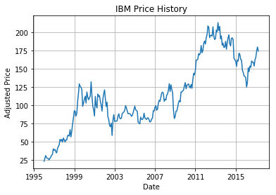
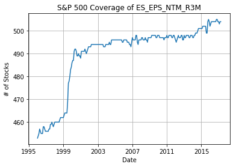
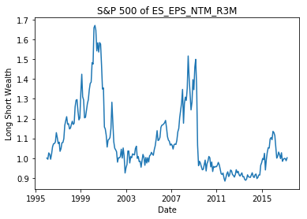
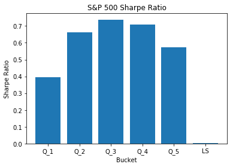
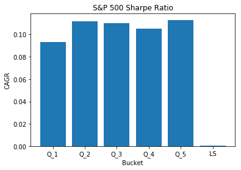

# QES LQuant Python API


This examples illustrates the working of Python interface to LQuant&reg; data query library created by [Wolfe Research](https://www.wolferesearch.com). The API paralles the R API.

LQuant core data query library is written in Java and Analytics library in R. Python API is a thin wrapper on both libraries. Additional resources available to understand the architecture is available in public Github that can be used to cross reference some of the functionality

- [Oveview](https://github.com/wolferesearch/docs/blob/master/wquant.md)
- [Data Query Engine R API](https://github.com/wolferesearch/docs/blob/master/r-api/wquantR.pdf)
- [Analytics Library R API](https://github.com/wolferesearch/docs/blob/master/r-api/lqtool.pdf)


## Architecture

Our infrastructure is completed hosted on Amazon Cloud (AWS). We attempt to leverage the greatest and latest of the technologies. Here is the overview of our data pipeline


## lquantPy (Python Package)

`lquantPy` is a python package available on servers hosted by Wolfe Research. The package provides access to the data query API. For Python, we use [`numpy`](http://www.numpy.org/) and [`pandas`](http://pandas.pydata.org/) as the data container. The main file to import for lquantPy is the LQuant. This below code should be executed exactly once per python session. Invoking this code twice would throw an java initialization error. 


```python
# Import the LQuant Python Librar
from lquantPy import LQuant

# It is recommended to use the naming of variable to be wq in order to be consistent with R API. 
wq=LQuant.LQuant()
```

    2017-10-18 12:51:32,052 - lquantPy.LQuant - INFO - Initial LQuant. This may take some time...
    2017-10-18 12:51:32,053 - lquantPy.LQuant - INFO - Initialized LQuant environment
    2017-10-18 12:51:32,054 - lquantPy.LQuant - INFO - Initializing LQuant, This will take some time....


    Library Path -Djava.library.path=/usr/local/lib/R/site-library/rJava/jri


### Data Query API

LQuant Python API has a fluent API to build the data request object and executing it. Here is an example of the API to retrieve for attributes

1. Company Name (COMPANYNAME)
2. Return on Equity (ROE)
3. Moving Average 15W-36W (MA_15_36)
4. EPS 3-month revision (ES_EPS_NTM_R3M)
5. Close Price (PRCCD)
6. Cumulative Dividend Cash Flow (CUM_DIV) 


```python

# Build Request Object
req = wq.new_request().start('1995-12-31').to('2017-03-31').\
    runFor('SP500').at('1me').a('COMPANYNAME').a('ROE').a('MA_15_36').a('ES_EPS_NTM_R3M').a('PRCCD').a('CUM_DIV').a('IN_SP500')

# Execute Query
data = wq.get_data(req)  


```

    2017-10-18 13:47:02,580 - lquantPy.LQuant - INFO - Fetching Data


## Data Request

In this example the `SP500` is the universe mnemonic that represent constituents of S&P 500 Index. The data is requested from 31-Dec-1995 to 31-Mar-2017. The `at` parameter specifies the frequency of data, `1me` stands for 1 month-end frequency. It will ensure that data is computed at the end of the month. Other available frequencies are:

#### Available Frequencies 

- `1d`

    Daily Frequency. Number 1 can be replaced with any integer to specify arbitrary frequency, e.g., 43d
    
    
- `1m[e,s]`

    Monthly Frequency. Number 1 can be replaced with any integer to specify arbitrary frequency, e.g., 2m. Note that suffix is optional. If `e` is used, then it would provide month end dates and `s` would provide month start dates. Default behavior without the suffix is to increment month starting from the start date, so if the middle of the month is selected as the start date, all dates will be middle of the month
    
    
- `1w`

    Weekly Frequency. Number 1 can be replaced with any integer to specify arbitrary frequency, e.g., 7w
    
    
- `1q[e,s]`

    Quarterly Frequency. Number 1 can be replaced with any integer to specify arbitrary frequency, e.g., 2q. Note that suffix is optional. If `e` is used, then it would provide quarter end dates and `s` would provide quarter start dates. Default behavior without the suffix is to increment quarter starting from the start date, so if the middle of the quarter is selected as the start date, all dates will be middle of the quarter
    
    
- `1y[e,s]`

    Yearly Frequency. Number 1 can be replaced with any integer to specify arbitrary frequency, e.g., 3y. Note that suffix is optional. If `e` is used, then it would provide year end dates and `s` would provide year start dates. Default behavior without the suffix is to increment year starting from the start date, so if the middle of the year is selected as the start date, all dates will be middle of the month

For list of factors and universes, please see the search functionality at the end of the notebook. 
 
The returned object data is a custom data structure stored in library. There are convenient methods to convert this data to standard objects in python, such as Pandas.

#### Other directives for the request object

- rebalanceTime(timezone,time)

    Uses a specific time within a date as the cutoff date for data. 
    
    
- forDates(dates)

    You can use this to specifiy custom dates array. This should be not used along with start and to directives. 
    
    
- nullWhenMissing()

    Use this directive to return null when an attribute is missing. 
    
    
- globalMode()

    Use this directive to set data source to global. This has implication for universes that consist US and non-US securities. When set in global mode, lquant uses the global data provider (e.g., Capital IQ Premium Financial) as opposed to Compustat. 
    

- setNoCache(noCache)

    Use this directive to skip the cache. The query will directly go to the database or original source for data. Using this option can significantly slow down the query execution. 
    
    
- batchSize(int size)

    Use this size to control the batch size of data retrieval. The default batch is 5. Increasing batch size increase the memory requirement of Java side. This parameter can potentially be used to improve the performance of data query


- inCurrency(currencyIsoCode)

    Use this directive to set a fixed currency for factor evaluation. The default behavior is to use local currency. 

## Meta Data (List of Available Factors)

Client can programmatically get the list of factors available to them. The `wq.get_factors()` command will return a Pandas data frame that can be further used to browse through the factors. For all available factors, please see the [search](http://rstudio2.luoquant.com/julia/user/karora/notebooks/LQuant%20Python%20Example.ipynb#Search-API) part of the notebook. 


```python
# Clients are provided access to a selected set of factors to work with. You can easily access these factors
#

factors = wq.get_factors()
```


<div>
<style>
    .dataframe thead tr:only-child th {
        text-align: right;
    }

    .dataframe thead th {
        text-align: left;
    }

    .dataframe tbody tr th {
        vertical-align: top;
    }
</style>
<table border="1" class="dataframe">
  <thead>
    <tr style="text-align: right;">
      <th></th>
      <th>Mnemonic</th>
      <th>Expression</th>
      <th>Function</th>
      <th>Args</th>
      <th>Description</th>
      <th>Unit</th>
      <th>Is Value</th>
      <th>Frequency</th>
      <th>Adjustment Type</th>
      <th>Fx Adjustment</th>
      <th>Staleness Threshold</th>
    </tr>
  </thead>
  <tbody>
    <tr>
      <th>0</th>
      <td>OA_GR</td>
      <td>(AOQ-AOQ_P4)/max(abs(AOQ_P4),0.02)</td>
      <td></td>
      <td></td>
      <td>Growth in other assets [Quality.Capital utiliz...</td>
      <td>WHOLE</td>
      <td>No</td>
      <td></td>
      <td>None</td>
      <td>No Adjustment</td>
      <td>3y</td>
    </tr>
    <tr>
      <th>1</th>
      <td>ES_SALE_NTM_R1M</td>
      <td>nvl(CIQ_ES_SALE_NTM_R1M,TRE_ES_SALE_NTM_R1M)</td>
      <td></td>
      <td></td>
      <td>NTM revenue revision, 1M [Analyst sentiment.Re...</td>
      <td>WHOLE</td>
      <td>No</td>
      <td></td>
      <td>None</td>
      <td>No Adjustment</td>
      <td>3y</td>
    </tr>
    <tr>
      <th>2</th>
      <td>EPS_VARIA</td>
      <td>nvl(CIQ_EPS_VARIA,TRE_EPS_VARIA)</td>
      <td></td>
      <td></td>
      <td>FY1 EPS coefficient of variation [Quality.Stab...</td>
      <td>WHOLE</td>
      <td>No</td>
      <td></td>
      <td>None</td>
      <td>No Adjustment</td>
      <td>3y</td>
    </tr>
    <tr>
      <th>3</th>
      <td>GR_FY1_SALE</td>
      <td>nvl(CIQ_GR_FY1_SALE,TRE_GR_FY1_SALE)</td>
      <td></td>
      <td></td>
      <td>FY1 Revenue growth [Growth.Expected growth] --...</td>
      <td>WHOLE</td>
      <td>No</td>
      <td></td>
      <td>None</td>
      <td>No Adjustment</td>
      <td>3y</td>
    </tr>
    <tr>
      <th>4</th>
      <td>PE_FY1</td>
      <td>nvl(CIQ_PE_FY1,TRE_PE_FY1)</td>
      <td></td>
      <td></td>
      <td>Price-to-EPS, FY1 Median [SPLT_PRCCD/ES_EPS_FY...</td>
      <td>WHOLE</td>
      <td>No</td>
      <td></td>
      <td>None</td>
      <td>No Adjustment</td>
      <td>3y</td>
    </tr>
    <tr>
      <th>5</th>
      <td>PE_FY2</td>
      <td>nvl(CIQ_PE_FY2,TRE_PE_FY2)</td>
      <td></td>
      <td></td>
      <td>Price-to-EPS, FY2 Median [SPLT_PRCCD/ES_EPS_FY...</td>
      <td>WHOLE</td>
      <td>No</td>
      <td></td>
      <td>None</td>
      <td>No Adjustment</td>
      <td>3y</td>
    </tr>
    <tr>
      <th>6</th>
      <td>TRIX</td>
      <td>@mgrowth(@mexpavg(@mexpavg(@mexpavg(PRCCD,15d)...</td>
      <td></td>
      <td></td>
      <td>TRIX</td>
      <td>WHOLE</td>
      <td>No</td>
      <td></td>
      <td>None</td>
      <td>No Adjustment</td>
      <td>3y</td>
    </tr>
    <tr>
      <th>7</th>
      <td>EBITDA_SUR</td>
      <td>TRE_EST_EBT_SUP_FY1</td>
      <td></td>
      <td></td>
      <td>EBITDA surprise (vs consensus) [Analyst sentim...</td>
      <td>WHOLE</td>
      <td>No</td>
      <td></td>
      <td>None</td>
      <td>No Adjustment</td>
      <td>3y</td>
    </tr>
    <tr>
      <th>8</th>
      <td>ES_EPS_FY1_D1M</td>
      <td>nvl((CIQ_EST_REV_EPS_UP_1M_FY1-CIQ_EST_REV_EPS...</td>
      <td></td>
      <td></td>
      <td>FY1 EPS diffusion (up/down ratio), 1M [Analyst...</td>
      <td>WHOLE</td>
      <td>No</td>
      <td></td>
      <td>None</td>
      <td>No Adjustment</td>
      <td>3y</td>
    </tr>
    <tr>
      <th>9</th>
      <td>GR_INTR_CFPS</td>
      <td>OANCFQ_G12M</td>
      <td></td>
      <td></td>
      <td>Historical YoY interim CFPS growth [Growth.His...</td>
      <td>WHOLE</td>
      <td>No</td>
      <td></td>
      <td>None</td>
      <td>No Adjustment</td>
      <td>3y</td>
    </tr>
    <tr>
      <th>10</th>
      <td>PSALE</td>
      <td>PRCCD*CSHOQ/max(SALEQ_LTM,0.05)</td>
      <td></td>
      <td></td>
      <td>Price-to-sales [Value.Revenue] -- [SPLT_PRCCD/...</td>
      <td>WHOLE</td>
      <td>No</td>
      <td></td>
      <td>None</td>
      <td>No Adjustment</td>
      <td>3y</td>
    </tr>
    <tr>
      <th>11</th>
      <td>P_TREND</td>
      <td>@mslope(log(PRCCD),1y)</td>
      <td></td>
      <td></td>
      <td>Price trend, 12M</td>
      <td>WHOLE</td>
      <td>No</td>
      <td></td>
      <td>None</td>
      <td>No Adjustment</td>
      <td>3y</td>
    </tr>
    <tr>
      <th>12</th>
      <td>ALTMAN1968</td>
      <td>1.2*(WCAPQ/max(ATQ,0.02))+1.4*(__REQ/max(ATQ,0...</td>
      <td></td>
      <td></td>
      <td>Altman's z-score [1968] [Quality.Financial lev...</td>
      <td>WHOLE</td>
      <td>No</td>
      <td></td>
      <td>None</td>
      <td>No Adjustment</td>
      <td>3y</td>
    </tr>
    <tr>
      <th>13</th>
      <td>DIVYLD_TRL</td>
      <td>100*nvl(DIV_LTM,0.0)/max(PRCCD,0.05)</td>
      <td></td>
      <td></td>
      <td>Trailing dividend yield [Value.Dividend] -- [1...</td>
      <td>WHOLE</td>
      <td>No</td>
      <td></td>
      <td>None</td>
      <td>No Adjustment</td>
      <td>3y</td>
    </tr>
    <tr>
      <th>14</th>
      <td>ES_TP_D1M</td>
      <td>nvl((CIQ_REV_PTG_AVG_UP_1M_FY1-CIQ_REV_PTG_AVG...</td>
      <td></td>
      <td></td>
      <td>Target price diffusion (up/down ratio), 1M [An...</td>
      <td>WHOLE</td>
      <td>No</td>
      <td></td>
      <td>None</td>
      <td>No Adjustment</td>
      <td>3y</td>
    </tr>
    <tr>
      <th>15</th>
      <td>ES_CFPS_NTM_R1M</td>
      <td>nvl(CIQ_ES_CFPS_NTM_R1M,TRE_ES_CFPS_NTM_R1M)</td>
      <td></td>
      <td></td>
      <td>NTM CFPS revision, 1M [Analyst sentiment.CFPS]...</td>
      <td>WHOLE</td>
      <td>No</td>
      <td></td>
      <td>None</td>
      <td>No Adjustment</td>
      <td>3y</td>
    </tr>
    <tr>
      <th>16</th>
      <td>ES_EBITDA_FY1_R3M</td>
      <td>nvl(CIQ_ES_EBITDA_FY1_R3M,TRE_ES_EBITDA_FY1_R3M)</td>
      <td></td>
      <td></td>
      <td>FY1 EBITDA revision, 3M [Defined in the [Estim...</td>
      <td>WHOLE</td>
      <td>No</td>
      <td></td>
      <td>None</td>
      <td>No Adjustment</td>
      <td>3y</td>
    </tr>
    <tr>
      <th>17</th>
      <td>ES_DPS_FY1_D1M</td>
      <td>nvl((CIQ_EST_REV_DPS_UP_1M_FY1-CIQ_EST_REV_DPS...</td>
      <td></td>
      <td></td>
      <td>FY1 DPS diffusion (up/down ratio), 1M [Analyst...</td>
      <td>WHOLE</td>
      <td>No</td>
      <td></td>
      <td>None</td>
      <td>No Adjustment</td>
      <td>3y</td>
    </tr>
    <tr>
      <th>18</th>
      <td>SALE_SUR</td>
      <td>TRE_EST_SAL_SUP_FY1</td>
      <td></td>
      <td></td>
      <td>Revenue surprise (vs consensus) [Analyst senti...</td>
      <td>WHOLE</td>
      <td>No</td>
      <td></td>
      <td>None</td>
      <td>No Adjustment</td>
      <td>3y</td>
    </tr>
    <tr>
      <th>19</th>
      <td>INVENT_TO</td>
      <td>COGSQ_LTM/max((INVTQ_P0+INVTQ_P4)/2,0.02)</td>
      <td></td>
      <td></td>
      <td>Inventory turnover [Quality.Financial leverage...</td>
      <td>WHOLE</td>
      <td>No</td>
      <td></td>
      <td>None</td>
      <td>No Adjustment</td>
      <td>3y</td>
    </tr>
    <tr>
      <th>20</th>
      <td>DEBT_EQUITY</td>
      <td>(DLCQ+DLTTQ)/max(SEQQ,0.02)</td>
      <td></td>
      <td></td>
      <td>Total debt/total equity [Quality.Financial lev...</td>
      <td>WHOLE</td>
      <td>No</td>
      <td></td>
      <td>None</td>
      <td>No Adjustment</td>
      <td>3y</td>
    </tr>
    <tr>
      <th>21</th>
      <td>PPE_GR</td>
      <td>(PPENTQ-PPENTQ_P4)/max(abs(PPENTQ_P4),0.02)</td>
      <td></td>
      <td></td>
      <td>Growth in property, plan, and equipment [Quali...</td>
      <td>WHOLE</td>
      <td>No</td>
      <td></td>
      <td>None</td>
      <td>No Adjustment</td>
      <td>3y</td>
    </tr>
    <tr>
      <th>22</th>
      <td>DIVYLD_FY1</td>
      <td>nvl(CIQ_DIVYLD_FY1,TRE_DIVYLD_FY1)</td>
      <td></td>
      <td></td>
      <td>Dividend yield, FY1[100*ES_DPS_FY1_ME/SPLT_PRC...</td>
      <td>WHOLE</td>
      <td>No</td>
      <td></td>
      <td>None</td>
      <td>No Adjustment</td>
      <td>3y</td>
    </tr>
    <tr>
      <th>23</th>
      <td>PRCCD</td>
      <td>PRCCD</td>
      <td></td>
      <td></td>
      <td>Price Close - Daily</td>
      <td>PER_SHARE</td>
      <td>Yes</td>
      <td>DAILY</td>
      <td>Per Share(V/Adjustment Factor)</td>
      <td>Values are adjusted at the spot fx rate of dat...</td>
      <td>m</td>
    </tr>
    <tr>
      <th>24</th>
      <td>ROIC</td>
      <td>100*IBMIIQ_LTM/max(ICAPTQ,0.02)</td>
      <td></td>
      <td></td>
      <td>ROIC, LTM [Quality.Profitability] -- [100*IS_L...</td>
      <td>WHOLE</td>
      <td>No</td>
      <td></td>
      <td>None</td>
      <td>No Adjustment</td>
      <td>3y</td>
    </tr>
    <tr>
      <th>25</th>
      <td>CFPS_SUR</td>
      <td>TRE_EST_CPS_SUP_FY1</td>
      <td></td>
      <td></td>
      <td>CFPS surprise (vs consensus) [Analyst sentimen...</td>
      <td>WHOLE</td>
      <td>No</td>
      <td></td>
      <td>None</td>
      <td>No Adjustment</td>
      <td>3y</td>
    </tr>
    <tr>
      <th>26</th>
      <td>ES_BPS_NTM_R1M</td>
      <td>nvl(CIQ_ES_BPS_NTM_R1M,TRE_ES_BPS_NTM_R1M)</td>
      <td></td>
      <td></td>
      <td>NTM BPS revision, 1M [Analyst sentiment.BPS] -...</td>
      <td>WHOLE</td>
      <td>No</td>
      <td></td>
      <td>None</td>
      <td>No Adjustment</td>
      <td>3y</td>
    </tr>
    <tr>
      <th>27</th>
      <td>ROE_STAB</td>
      <td>ROE_AV5Y</td>
      <td></td>
      <td></td>
      <td>ROE stability, 5Y [Quality.Stability in profit...</td>
      <td>WHOLE</td>
      <td>No</td>
      <td></td>
      <td>None</td>
      <td>No Adjustment</td>
      <td>3y</td>
    </tr>
    <tr>
      <th>28</th>
      <td>VOL_VO_P_12M</td>
      <td>@mstd(log(CSHTRD/PRCCD),1y)</td>
      <td></td>
      <td></td>
      <td>Volatility of volume/price, 12M</td>
      <td>WHOLE</td>
      <td>No</td>
      <td></td>
      <td>None</td>
      <td>No Adjustment</td>
      <td>3y</td>
    </tr>
    <tr>
      <th>29</th>
      <td>EXP_DIV_PAYOUT</td>
      <td>nvl(CIQ_EXP_DIV_PAYOUT,TRE_EXP_DIV_PAYOUT)</td>
      <td></td>
      <td></td>
      <td>Dividend payout ratio, expected [Quality.Divid...</td>
      <td>WHOLE</td>
      <td>No</td>
      <td></td>
      <td>None</td>
      <td>No Adjustment</td>
      <td>3y</td>
    </tr>
    <tr>
      <th>...</th>
      <td>...</td>
      <td>...</td>
      <td>...</td>
      <td>...</td>
      <td>...</td>
      <td>...</td>
      <td>...</td>
      <td>...</td>
      <td>...</td>
      <td>...</td>
      <td>...</td>
    </tr>
    <tr>
      <th>255</th>
      <td>AC_5Y_OEPS</td>
      <td>@m2slope(OPEPSQ,5y)/PRCCD</td>
      <td></td>
      <td></td>
      <td>Historical 5Y operating EPS growth acceleration</td>
      <td>WHOLE</td>
      <td>No</td>
      <td></td>
      <td>None</td>
      <td>No Adjustment</td>
      <td>3y</td>
    </tr>
    <tr>
      <th>256</th>
      <td>MFI</td>
      <td>100-(100/(1+@msum(ifelse(PRCCD&gt;PRCCD_L1D,CSHTR...</td>
      <td></td>
      <td></td>
      <td>Money Flow Index</td>
      <td>WHOLE</td>
      <td>No</td>
      <td></td>
      <td>None</td>
      <td>No Adjustment</td>
      <td>3y</td>
    </tr>
    <tr>
      <th>257</th>
      <td>ES_EBIT_NTM_R3M</td>
      <td>nvl(CIQ_ES_EBIT_NTM_R3M,TRE_ES_EBIT_NTM_R3M)</td>
      <td></td>
      <td></td>
      <td>NTM EBIT revision, 3M[Defined in the [Estimate...</td>
      <td>WHOLE</td>
      <td>No</td>
      <td></td>
      <td>None</td>
      <td>No Adjustment</td>
      <td>3y</td>
    </tr>
    <tr>
      <th>258</th>
      <td>FXRATE_USD</td>
      <td>USD</td>
      <td></td>
      <td></td>
      <td>FX Rate Converted from choosen currency</td>
      <td>WHOLE</td>
      <td>No</td>
      <td></td>
      <td>None</td>
      <td>No Adjustment</td>
      <td></td>
    </tr>
    <tr>
      <th>259</th>
      <td>ES_GAP</td>
      <td>CIQ_ES_GAP</td>
      <td></td>
      <td></td>
      <td>Expectation gap (5Y exp growth - FY2 growth) [...</td>
      <td>WHOLE</td>
      <td>No</td>
      <td></td>
      <td>None</td>
      <td>No Adjustment</td>
      <td>3y</td>
    </tr>
    <tr>
      <th>260</th>
      <td>EPSYLD_GRO</td>
      <td>EPSYLD_LTM_B*nvl(CIQ_EST_EPS_MED_LTG,TRE_EST_E...</td>
      <td></td>
      <td></td>
      <td>Earnings yield (LTM, basic) x 5Y Exp Growth</td>
      <td>WHOLE</td>
      <td>No</td>
      <td></td>
      <td>None</td>
      <td>No Adjustment</td>
      <td>3y</td>
    </tr>
    <tr>
      <th>261</th>
      <td>GR_EXP_5Y_EPS</td>
      <td>nvl(CIQ_GR_EXP_5Y_EPS,TRE_GR_EXP_5Y_EPS)</td>
      <td></td>
      <td></td>
      <td>Consensus expected 5Y EPS growth [Growth.Expec...</td>
      <td>WHOLE</td>
      <td>No</td>
      <td></td>
      <td>None</td>
      <td>No Adjustment</td>
      <td>3y</td>
    </tr>
    <tr>
      <th>262</th>
      <td>ES_EBIT_FY1_D3M</td>
      <td>nvl((CIQ_EST_REV_EBI_UP_3M_FY1-CIQ_EST_REV_EBI...</td>
      <td></td>
      <td></td>
      <td>FY1 EBIT diffusion (up/down ratio), 3M [Analys...</td>
      <td>WHOLE</td>
      <td>No</td>
      <td></td>
      <td>None</td>
      <td>No Adjustment</td>
      <td>3y</td>
    </tr>
    <tr>
      <th>263</th>
      <td>SHARE_CHG</td>
      <td>100*(CSHOQ-CSHOQ_P4)/max(CSHOQ_P4,0.02)</td>
      <td></td>
      <td></td>
      <td>YoY change in share count [Quality.Capital uti...</td>
      <td>WHOLE</td>
      <td>No</td>
      <td></td>
      <td>None</td>
      <td>No Adjustment</td>
      <td>3y</td>
    </tr>
    <tr>
      <th>264</th>
      <td>DEBT_CAPITAL</td>
      <td>(DLCQ+DLTTQ)/max(ICAPTQ,0.02)</td>
      <td></td>
      <td></td>
      <td>Total debt/total capital [Quality.Financial le...</td>
      <td>WHOLE</td>
      <td>No</td>
      <td></td>
      <td>None</td>
      <td>No Adjustment</td>
      <td>3y</td>
    </tr>
    <tr>
      <th>265</th>
      <td>ES_TP_D3M</td>
      <td>nvl((CIQ_REV_PTG_AVG_UP_3M_FY1-CIQ_REV_PTG_AVG...</td>
      <td></td>
      <td></td>
      <td>Target price diffusion (up/down ratio), 3M [An...</td>
      <td>WHOLE</td>
      <td>No</td>
      <td></td>
      <td>None</td>
      <td>No Adjustment</td>
      <td>3y</td>
    </tr>
    <tr>
      <th>266</th>
      <td>TP_RTN</td>
      <td>nvl(CIQ_TP_RTN,TRE_TP_RTN)</td>
      <td></td>
      <td></td>
      <td>Target price implied return [(ES_TP_ME-SPLT_PR...</td>
      <td>WHOLE</td>
      <td>No</td>
      <td></td>
      <td>None</td>
      <td>No Adjustment</td>
      <td>3y</td>
    </tr>
    <tr>
      <th>267</th>
      <td>MA_15_36</td>
      <td>PRCCD_AV15W/PRCCD_AV36W</td>
      <td></td>
      <td></td>
      <td>Moving average crossover, 15W-36W [Alternative...</td>
      <td>WHOLE</td>
      <td>No</td>
      <td></td>
      <td>None</td>
      <td>No Adjustment</td>
      <td>3y</td>
    </tr>
    <tr>
      <th>268</th>
      <td>REAL_VOL</td>
      <td>RTN1D_STD1Y</td>
      <td></td>
      <td></td>
      <td>Realized vol, 1Y daily [Alternative.Risk] -- [...</td>
      <td>WHOLE</td>
      <td>No</td>
      <td></td>
      <td>None</td>
      <td>No Adjustment</td>
      <td>3y</td>
    </tr>
    <tr>
      <th>269</th>
      <td>CCI</td>
      <td>(TypicalPrice-@mavg(TypicalPrice,1m))/@mstd(Ty...</td>
      <td></td>
      <td></td>
      <td>Commodity Channel Index</td>
      <td>WHOLE</td>
      <td>No</td>
      <td></td>
      <td>None</td>
      <td>No Adjustment</td>
      <td>3y</td>
    </tr>
    <tr>
      <th>270</th>
      <td>GR_EINTR_CFPS</td>
      <td>nvl(CIQ_EST_CPS_GRO_YOQ,100*(TRE_EST_CPS_MED_F...</td>
      <td></td>
      <td></td>
      <td>YoY expected interim CFPS growth [Growth.Expec...</td>
      <td>WHOLE</td>
      <td>No</td>
      <td></td>
      <td>None</td>
      <td>No Adjustment</td>
      <td>3y</td>
    </tr>
    <tr>
      <th>271</th>
      <td>GR_FY2_DPS</td>
      <td>nvl(CIQ_GR_FY2_DPS,TRE_GR_FY2_DPS)</td>
      <td></td>
      <td></td>
      <td>FY2 DPS growth [(ES_DPS_FY1_ME-ES_DPS_FY1_ME)/...</td>
      <td>WHOLE</td>
      <td>No</td>
      <td></td>
      <td>None</td>
      <td>No Adjustment</td>
      <td>3y</td>
    </tr>
    <tr>
      <th>272</th>
      <td>ES_RECOMM_AVG</td>
      <td>nvl(CIQ_ES_RECOMM_AVG,TRE_ES_RECOMM_AVG)</td>
      <td></td>
      <td></td>
      <td>Mean recommendation [Analyst sentiment.Recomme...</td>
      <td>WHOLE</td>
      <td>No</td>
      <td></td>
      <td>None</td>
      <td>No Adjustment</td>
      <td>3y</td>
    </tr>
    <tr>
      <th>273</th>
      <td>EXT_FIN_NOA</td>
      <td>EXT_FINANCE_LTM/max(NOA,0.02)</td>
      <td></td>
      <td></td>
      <td>Net external financing/net operating assets [Q...</td>
      <td>WHOLE</td>
      <td>No</td>
      <td></td>
      <td>None</td>
      <td>No Adjustment</td>
      <td>3y</td>
    </tr>
    <tr>
      <th>274</th>
      <td>ISIN</td>
      <td>ISIN</td>
      <td></td>
      <td></td>
      <td>ISIN</td>
      <td>WHOLE</td>
      <td>Yes</td>
      <td></td>
      <td>None</td>
      <td>Values are adjusted at the spot fx rate of dat...</td>
      <td></td>
    </tr>
    <tr>
      <th>275</th>
      <td>ROE_CHG</td>
      <td>ROE-(100*IBMIIQ_LTM_P4)/max((TEQQ_P4+TEQQ_P8)/...</td>
      <td></td>
      <td></td>
      <td>YoY change in ROE [Quality.Change in profitabi...</td>
      <td>WHOLE</td>
      <td>No</td>
      <td></td>
      <td>None</td>
      <td>No Adjustment</td>
      <td>3y</td>
    </tr>
    <tr>
      <th>276</th>
      <td>LT_DT_EQ_CHG</td>
      <td>DLTTQ/max(CEQQ,0.02) - (DLTTQ_P4/max(CEQQ_P4,0...</td>
      <td></td>
      <td></td>
      <td>YoY change in long-term debt/common equity [Qu...</td>
      <td>WHOLE</td>
      <td>No</td>
      <td></td>
      <td>None</td>
      <td>No Adjustment</td>
      <td>3y</td>
    </tr>
    <tr>
      <th>277</th>
      <td>RTN_252D</td>
      <td>RTN365D</td>
      <td></td>
      <td></td>
      <td>Price momentum, 12M [Price momentum and revers...</td>
      <td>WHOLE</td>
      <td>No</td>
      <td></td>
      <td>None</td>
      <td>No Adjustment</td>
      <td>3y</td>
    </tr>
    <tr>
      <th>278</th>
      <td>ES_NAV_FY1_D1M</td>
      <td>nvl((CIQ_EST_REV_NAV_UP_1M_FY1-CIQ_EST_REV_NAV...</td>
      <td></td>
      <td></td>
      <td>FY1 NAV diffusion (up/down ratio), 1M [Analyst...</td>
      <td>WHOLE</td>
      <td>No</td>
      <td></td>
      <td>None</td>
      <td>No Adjustment</td>
      <td>3y</td>
    </tr>
    <tr>
      <th>279</th>
      <td>ES_NAV_NTM_R3M</td>
      <td>nvl(CIQ_ES_NAV_NTM_R3M,TRE_ES_NAV_NTM_R3M)</td>
      <td></td>
      <td></td>
      <td>NTM NAV revision, 3M [Analyst sentiment.NAV] -...</td>
      <td>WHOLE</td>
      <td>No</td>
      <td></td>
      <td>None</td>
      <td>No Adjustment</td>
      <td>3y</td>
    </tr>
    <tr>
      <th>280</th>
      <td>NET_MARGIN</td>
      <td>100*IBQ_LTM/max(SALEQ_LTM,0.02)</td>
      <td></td>
      <td></td>
      <td>Net income margin [Quality.Profitability] -- [...</td>
      <td>WHOLE</td>
      <td>No</td>
      <td></td>
      <td>None</td>
      <td>No Adjustment</td>
      <td>3y</td>
    </tr>
    <tr>
      <th>281</th>
      <td>REAL_VOL3M</td>
      <td>RTN1D_STD3M</td>
      <td></td>
      <td></td>
      <td>Realized vol, 3M daily [Alternative.Risk] -- [...</td>
      <td>WHOLE</td>
      <td>No</td>
      <td></td>
      <td>None</td>
      <td>No Adjustment</td>
      <td>3y</td>
    </tr>
    <tr>
      <th>282</th>
      <td>PI</td>
      <td>PI</td>
      <td></td>
      <td></td>
      <td>Pretax Income</td>
      <td>WHOLE</td>
      <td>Yes</td>
      <td>ANNUALLY</td>
      <td>None</td>
      <td>Values are adjusted at the blended rate for wh...</td>
      <td>3y</td>
    </tr>
    <tr>
      <th>283</th>
      <td>LT_DT_CAPITAL</td>
      <td>DLTTQ/max(ICAPTQ,0.02)</td>
      <td></td>
      <td></td>
      <td>Long-term debt/total capital [Quality.Financia...</td>
      <td>WHOLE</td>
      <td>No</td>
      <td></td>
      <td>None</td>
      <td>No Adjustment</td>
      <td>3y</td>
    </tr>
    <tr>
      <th>284</th>
      <td>CUM_DIV</td>
      <td>CS_DIV</td>
      <td>Cumulative sum over the period</td>
      <td></td>
      <td>Cumulative Dividend</td>
      <td>WHOLE</td>
      <td>No</td>
      <td></td>
      <td>None</td>
      <td>No Adjustment</td>
      <td></td>
    </tr>
  </tbody>
</table>
<p>285 rows × 11 columns</p>
</div>


```python

```


```python


#Print the data object
print(data)

```

    user1_lqtmp:List of 7 elements [[COMPANYNAME, ROE, MA_15_36, ES_EPS_NTM_R3M, PRCCD, CUM_DIV, IN_SP500]]


For storage efficiency, data is stored in proprietary LQuant format that can be easily converted to standard data structures in Python. In this example, `data` object holds data for S&P 500 companies, the names of the data elements are printed using the print command


```python

# You can retrieve element of the list by using the element function 
# by passing either the index or name of the data element, e.g., ROE

roe=data.element('ROE')
# Alternatively ROE matrix can be retrieved using data.element(0)

# The returned object is also a handle a data matrix stored in lquant library. 
# You can use columns and rows function on the object to see security ids and dates
print(roe.columns()[1:20])
print(roe.rows()[1:20])

```

    ['1996-01-31', '1996-02-29', '1996-03-31', '1996-04-30', '1996-05-31', '1996-06-30', '1996-07-31', '1996-08-31', '1996-09-30', '1996-10-31', '1996-11-30', '1996-12-31', '1997-01-31', '1997-02-28', '1997-03-31', '1997-04-30', '1997-05-31', '1997-06-30', '1997-07-31']
    ['001045.01', '001045.04', '001075.01', '001078.01', '001161.01', '001164.01', '001177.01', '001194.01', '001209.01', '001230.01', '001239.01', '001240.01', '001246.01', '001253.01', '001279.01', '001300.01', '001318.01', '001327.01', '001356.01']


### Converting to Pandas Data Frame

The lquant matrices can be easily converted into pandas data frame using the `as_matrix` function. We retain the matrix structure where rows are the securities and columns are dates. 


```python
# Converting to Pandas data frame
roe_as_pandas_data_frame=roe.as_matrix()
print(roe_as_pandas_data_frame.head(2))
```

               1995-12-31  1996-01-31  1996-02-29  1996-03-31  1996-04-30  \
    001013.01         NaN         NaN         NaN         NaN         NaN   
    001045.01    -0.06292   -0.060737   -0.058874    -0.06192   -0.075096   
    
               1996-05-31  1996-06-30  1996-07-31  1996-08-31  1996-09-30  \
    001013.01         NaN         NaN         NaN         NaN         NaN   
    001045.01   -0.080514   -0.080429   -0.031526   -0.034454   -0.034329   
    
                  ...      2016-06-30  2016-07-31  2016-08-31  2016-09-30  \
    001013.01     ...             NaN         NaN         NaN         NaN   
    001045.01     ...             NaN         NaN         NaN         NaN   
    
               2016-10-31  2016-11-30  2016-12-31  2017-01-31  2017-02-28  \
    001013.01         NaN         NaN         NaN         NaN         NaN   
    001045.01         NaN         NaN         NaN         NaN         NaN   
    
               2017-03-31  
    001013.01         NaN  
    001045.01         NaN  
    
    [2 rows x 256 columns]


Pandas data frame returned by the API will have the `index` and `columns` properties populated with securities ids and dates respectively. 


## Large Panda Data Frame

The data object from lquantPy can be converted into one large data frame with factors as columns. The Security Id and Date show up as columns in the panel data set. Below Example show how it can be done. Note that 


```python
df=data.as_large_data_frame()
print(df.head())


#d2=LQuant.LQGenericData(data.context, data.ref.toLargeDataFrame())
#d2.columns()
```

              ID       DATE                  COMPANYNAME      ROE  MA_15_36  \
    0  001013.01 1995-12-31  ADC Telecommunications Inc.      NaN       NaN   
    1  001045.01 1995-12-31  American Airlines Group Inc -0.06292 -0.507671   
    2  001045.04 1995-12-31  American Airlines Group Inc      NaN       NaN   
    3  001075.01 1995-12-31   Pinnacle West Capital Corp      NaN       NaN   
    4  001078.01 1995-12-31          Abbott Laboratories -0.06292 -0.031372   
    
       ES_EPS_NTM_R3M     PRCCD    CUM_DIV  IN_SP500  
    0             NaN  31.93751   0.000000       NaN  
    1        0.016934  37.12500   0.000000       1.0  
    2             NaN       NaN   0.000000       NaN  
    3             NaN  28.75000  16.740000       NaN  
    4       -0.051093  20.81250   2.529625       1.0  


```python
# Extracting data for a single security
df2 = df.loc[lambda x: x.ID == '006066.01', :]
df2.head()

```


<div>
<style>
    .dataframe thead tr:only-child th {
        text-align: right;
    }

    .dataframe thead th {
        text-align: left;
    }

    .dataframe tbody tr th {
        vertical-align: top;
    }
</style>
<table border="1" class="dataframe">
  <thead>
    <tr style="text-align: right;">
      <th></th>
      <th>ID</th>
      <th>DATE</th>
      <th>COMPANYNAME</th>
      <th>ROE</th>
      <th>MA_15_36</th>
      <th>ES_EPS_NTM_R3M</th>
      <th>PRCCD</th>
      <th>CUM_DIV</th>
      <th>IN_SP500</th>
    </tr>
  </thead>
  <tbody>
    <tr>
      <th>293</th>
      <td>006066.01</td>
      <td>1995-12-31</td>
      <td>International Business Machines Corp</td>
      <td>-0.062920</td>
      <td>-0.772774</td>
      <td>-0.032100</td>
      <td>22.84375</td>
      <td>11.1325</td>
      <td>1.0</td>
    </tr>
    <tr>
      <th>1357</th>
      <td>006066.01</td>
      <td>1996-01-31</td>
      <td>International Business Machines Corp</td>
      <td>-0.060737</td>
      <td>-0.592580</td>
      <td>0.055781</td>
      <td>27.12500</td>
      <td>11.1325</td>
      <td>1.0</td>
    </tr>
    <tr>
      <th>2421</th>
      <td>006066.01</td>
      <td>1996-02-29</td>
      <td>International Business Machines Corp</td>
      <td>-0.058874</td>
      <td>-0.308844</td>
      <td>0.154858</td>
      <td>30.65625</td>
      <td>11.1950</td>
      <td>1.0</td>
    </tr>
    <tr>
      <th>3485</th>
      <td>006066.01</td>
      <td>1996-03-31</td>
      <td>International Business Machines Corp</td>
      <td>-0.061920</td>
      <td>0.180661</td>
      <td>0.113959</td>
      <td>27.81250</td>
      <td>11.1950</td>
      <td>1.0</td>
    </tr>
    <tr>
      <th>4549</th>
      <td>006066.01</td>
      <td>1996-04-30</td>
      <td>International Business Machines Corp</td>
      <td>-0.075096</td>
      <td>0.954144</td>
      <td>-0.023223</td>
      <td>26.93750</td>
      <td>11.1950</td>
      <td>1.0</td>
    </tr>
  </tbody>
</table>
</div>


```python
# Seeing the data and visualizing it

import matplotlib.pyplot as plt
from datetime import datetime

%matplotlib inline

# Fetch Prices (Note that we are using the original data element and not the big data matrix to extract prices)
prccd=data.element('PRCCD').as_matrix()

# 006066.01 is the security id for IBM (see the search API for more information)
prc=prccd.loc['006066.01']
dates=[datetime.strptime(d, '%Y-%m-%d') for d in prccd.columns]

plt.plot(dates,prc.as_matrix())

plt.xlabel('Date')
plt.ylabel('Adjusted Price')
plt.title('IBM Price History')
plt.grid(True)
plt.show()

```





```python
# Extracting String attributes
company_name = data.element('COMPANYNAME').as_matrix()
print(company_name.loc['006066.01'].head())
```

    1995-12-31    International Business Machines Corp
    1996-01-31    International Business Machines Corp
    1996-02-29    International Business Machines Corp
    1996-03-31    International Business Machines Corp
    1996-04-30    International Business Machines Corp
    Name: 006066.01, dtype: object


## Backtest

User of LQuant have access to the backtesting library. The data object can be used to backtest. Below is the code illustrating it. 


```python
res=wq.basic_backtest(data,wq.new_backtest_request().forFactor('ES_EPS_NTM_R3M'))
print(res)
```

    List of 16 elements [[coverageRaw, coverage, SCs, ICs, turnover, basketReturns, wealth, maxDD, IR, Vol, CAGR, ICDecay, cumICDecay, hitRate, cumHitRate, ICs.stats]]


### Backtest Request

Additional directives can be added to the request object to change the behavior of backtesting

- withTCost(double val) 
    
    Directive can be used to set a fixed transaction cost in percentage. 
    
    
- withBins(int bins)
    
    This directive can be used to set the number of the buckets 
    
    
- coverageThreshold(double val)

    Set the Coverage threshold for the 
    
    
- classMatrixFactor(factor)

    Uses a class matrix to neutralize the factor. The class matrix factor should be queries in the data. 


```python
from datetime import datetime
import numpy as np
import matplotlib.pyplot as plt

%matplotlib inline


#plt.subplot(1, 2, 1)
## Coverage
coverage=res.coverage()
dates=[datetime.strptime(d, '%Y-%m-%d') for d in coverage.names()]
plt.plot(dates,coverage.as_double_array(),)
plt.xlabel('Date')
plt.ylabel('# of Stocks')
plt.title('S&P 500 Coverage of ES_EPS_NTM_R3M')
plt.grid(True)
plt.show()


```





```python
# Plot Wealth Curve
wealth = res.wealth().as_matrix()
wealth.columns = dates

plt.plot(dates,wealth.iloc[5])
plt.xlabel('Date')
plt.ylabel('Long Short Wealth')
plt.title('S&P 500 of ES_EPS_NTM_R3M')
plt.show()


```





```python
# Plot Sharpe Ratio
sharpe_ratio=res.sharpe_ratio()
x = np.arange(sharpe_ratio.length())
plt.bar(x, sharpe_ratio.as_double_array())
plt.xticks(x, sharpe_ratio.names())
plt.xlabel('Bucket')
plt.ylabel('Sharpe Ratio')
plt.title('S&P 500 Sharpe Ratio')
plt.show()


# Plot CAGR Ratio
CAGR=res.CAGR()
x = np.arange(CAGR.length())
plt.bar(x, CAGR.as_double_array())
plt.xticks(x, CAGR.names())
plt.xlabel('Bucket')
plt.ylabel('CAGR')
plt.title('S&P 500 CAGR')
plt.show()


```








### Search API

`lquantPy` has a search API to search through Universes, Attributes and Securities. They can be accessed via `searchUniverse`, `searchAttribute` and `searchSecurity` methods available in LQuant class. In the code below, we are looking for Portugal universe. 


```python
# Search for universes
# LQuant utilizes 
wq.search_universe('Portugal').head()
```


<div>
<style>
    .dataframe thead tr:only-child th {
        text-align: right;
    }

    .dataframe thead th {
        text-align: left;
    }

    .dataframe tbody tr th {
        vertical-align: top;
    }
</style>
<table border="1" class="dataframe">
  <thead>
    <tr style="text-align: right;">
      <th></th>
      <th>id</th>
      <th>vendorId</th>
      <th>vendorIdDataType</th>
      <th>name</th>
      <th>description</th>
      <th>inceptionDate</th>
      <th>region</th>
      <th>source</th>
      <th>args</th>
      <th>importance</th>
    </tr>
  </thead>
  <tbody>
    <tr>
      <th>0</th>
      <td>TQA_SPCBMICPTUSD</td>
      <td>175</td>
      <td>NUMERIC</td>
      <td>TQA BMI S&amp;P Portugal BMI (US Dollar)</td>
      <td>S&amp;P Portugal BMI (US Dollar)</td>
      <td>1980-01-01</td>
      <td>GLOBAL</td>
      <td>tqaBmiUniv</td>
      <td></td>
      <td>1</td>
    </tr>
    <tr>
      <th>1</th>
      <td>TQAMSCI_962000</td>
      <td>962000</td>
      <td>NUMERIC</td>
      <td>TQA MSCI PORTUGAL</td>
      <td>PORTUGAL</td>
      <td>1980-01-01</td>
      <td>GLOBAL</td>
      <td>msciIdx</td>
      <td></td>
      <td>1</td>
    </tr>
    <tr>
      <th>2</th>
      <td>TQA_SPCBMIVCPTUSD</td>
      <td>1249</td>
      <td>NUMERIC</td>
      <td>TQA BMI S&amp;P Portugal BMI Value (US Dollar)</td>
      <td>S&amp;P Portugal BMI Value (US Dollar)</td>
      <td>1980-01-01</td>
      <td>GLOBAL</td>
      <td>tqaBmiUniv</td>
      <td></td>
      <td>2</td>
    </tr>
    <tr>
      <th>3</th>
      <td>TQA_SPCBMIGCPTUSD</td>
      <td>967</td>
      <td>NUMERIC</td>
      <td>TQA BMI S&amp;P Portugal BMI Growth (US Dollar)</td>
      <td>S&amp;P Portugal BMI Growth (US Dollar)</td>
      <td>1980-01-01</td>
      <td>GLOBAL</td>
      <td>tqaBmiUniv</td>
      <td></td>
      <td>2</td>
    </tr>
    <tr>
      <th>4</th>
      <td>TQAMSCI_105940</td>
      <td>105940</td>
      <td>NUMERIC</td>
      <td>TQA MSCI PORTUGAL GROWTH</td>
      <td>PORTUGAL GROWTH</td>
      <td>1980-01-01</td>
      <td>GLOBAL</td>
      <td>msciIdx</td>
      <td></td>
      <td>2</td>
    </tr>
  </tbody>
</table>
</div>


```python
wq.search_security('Apple').head()
```


<div>
<style>
    .dataframe thead tr:only-child th {
        text-align: right;
    }

    .dataframe thead th {
        text-align: left;
    }

    .dataframe tbody tr th {
        vertical-align: top;
    }
</style>
<table border="1" class="dataframe">
  <thead>
    <tr style="text-align: right;">
      <th></th>
      <th>id</th>
      <th>ticker</th>
      <th>exchange</th>
      <th>name</th>
      <th>currency</th>
      <th>status</th>
      <th>descr</th>
      <th>source</th>
      <th>primflag</th>
      <th>sedol</th>
      <th>importance</th>
      <th>isoCurrency</th>
      <th>country</th>
      <th>region</th>
      <th>isoCountry</th>
      <th>cusip</th>
      <th>isin</th>
    </tr>
  </thead>
  <tbody>
    <tr>
      <th>0</th>
      <td>001690.01</td>
      <td>AAPL</td>
      <td>NASDAQ</td>
      <td>Apple Inc-COM NPV</td>
      <td>US Dollar</td>
      <td>A</td>
      <td>Apple Inc. designs, manufactures, and markets ...</td>
      <td>NA</td>
      <td>Y</td>
      <td>2046251</td>
      <td>1</td>
      <td>USD</td>
      <td>United States</td>
      <td>United States and Canada</td>
      <td>US</td>
      <td>037833100</td>
      <td>US0378331005</td>
    </tr>
    <tr>
      <th>1</th>
      <td>304348005</td>
      <td></td>
      <td>SIX Swiss Exchange</td>
      <td>Apple Inc.- Common Stock</td>
      <td>Euro</td>
      <td>A</td>
      <td></td>
      <td>GLOBAL</td>
      <td>Y</td>
      <td></td>
      <td>2</td>
      <td>EUR</td>
      <td>Switzerland</td>
      <td>Europe</td>
      <td>CH</td>
      <td></td>
      <td></td>
    </tr>
    <tr>
      <th>2</th>
      <td>2590360</td>
      <td>AAPL</td>
      <td>Nasdaq Global Select</td>
      <td>Apple Inc.-Common Stock</td>
      <td>US Dollar</td>
      <td>A</td>
      <td></td>
      <td>GLOBAL</td>
      <td>Y</td>
      <td>2046251</td>
      <td>2</td>
      <td>USD</td>
      <td>United States</td>
      <td>United States and Canada</td>
      <td>US</td>
      <td></td>
      <td></td>
    </tr>
    <tr>
      <th>3</th>
      <td>308716962</td>
      <td>AAPL</td>
      <td>Bolsa de Valores de Lima</td>
      <td>Apple Inc.-Common Stock</td>
      <td>US Dollar</td>
      <td>A</td>
      <td></td>
      <td>GLOBAL</td>
      <td>N</td>
      <td>BYS3934</td>
      <td>3</td>
      <td>USD</td>
      <td>Peru</td>
      <td>Latin America and Caribbean</td>
      <td>PE</td>
      <td></td>
      <td></td>
    </tr>
    <tr>
      <th>4</th>
      <td>260339402</td>
      <td>AAPL</td>
      <td>Wiener Boerse AG</td>
      <td>Apple Inc.-Common Stock</td>
      <td>Euro</td>
      <td>A</td>
      <td></td>
      <td>GLOBAL</td>
      <td>N</td>
      <td>BF1SS69</td>
      <td>3</td>
      <td>EUR</td>
      <td>Austria</td>
      <td>Europe</td>
      <td>AT</td>
      <td></td>
      <td></td>
    </tr>
  </tbody>
</table>
</div>


```python
wq.search_attribute('Earnings Per Share').head()
```


<div>
<style>
    .dataframe thead tr:only-child th {
        text-align: right;
    }

    .dataframe thead th {
        text-align: left;
    }

    .dataframe tbody tr th {
        vertical-align: top;
    }
</style>
<table border="1" class="dataframe">
  <thead>
    <tr style="text-align: right;">
      <th></th>
      <th>Mnemonic</th>
      <th>Expression</th>
      <th>Function</th>
      <th>Args</th>
      <th>Description</th>
      <th>Unit</th>
      <th>Is Value</th>
      <th>Frequency</th>
      <th>Adjustment Type</th>
      <th>Fx Adjustment</th>
      <th>Staleness Threshold</th>
    </tr>
  </thead>
  <tbody>
    <tr>
      <th>0</th>
      <td>CS_EPS</td>
      <td>EPS</td>
      <td></td>
      <td></td>
      <td>Earnings Per Share - Current</td>
      <td>PER_SHARE</td>
      <td>Yes</td>
      <td>DAILY</td>
      <td>Per Share(V/Adjustment Factor)</td>
      <td>Values are adjusted at the spot fx rate of dat...</td>
      <td>20y</td>
    </tr>
    <tr>
      <th>1</th>
      <td>CS_EPSMO</td>
      <td>EPSMO</td>
      <td></td>
      <td></td>
      <td>Earnings Per Share Month - Current</td>
      <td>PER_SHARE</td>
      <td>Yes</td>
      <td>DAILY</td>
      <td>Per Share(V/Adjustment Factor)</td>
      <td>Values are adjusted at the spot fx rate of dat...</td>
      <td>20y</td>
    </tr>
    <tr>
      <th>2</th>
      <td>CIQ_142</td>
      <td>142</td>
      <td></td>
      <td></td>
      <td>This item represents the diluted earnings per ...</td>
      <td>PER_SHARE</td>
      <td>Yes</td>
      <td>ANNUALLY</td>
      <td>None</td>
      <td>Values are adjusted at the blended rate for wh...</td>
      <td>3y</td>
    </tr>
    <tr>
      <th>3</th>
      <td>CIQ_142_Q</td>
      <td>142</td>
      <td></td>
      <td></td>
      <td>This item represents the diluted earnings per ...</td>
      <td>PER_SHARE</td>
      <td>Yes</td>
      <td>QUARTERLY</td>
      <td>None</td>
      <td>Values are adjusted at the blended rate for wh...</td>
      <td>18m</td>
    </tr>
    <tr>
      <th>4</th>
      <td>IQ_DILUT_EPS_EXCL</td>
      <td>142</td>
      <td></td>
      <td></td>
      <td>This item represents the diluted earnings per ...</td>
      <td>PER_SHARE</td>
      <td>Yes</td>
      <td>ANNUALLY</td>
      <td>None</td>
      <td>Values are adjusted at the blended rate for wh...</td>
      <td>3y</td>
    </tr>
  </tbody>
</table>
</div>


### Defining New Factors

You can dynamically create new factors using existing. Simple mathematical expression can be constructed. The expression support simple mathematical functions (e.g., abs, exp, pow, log) and operators (e.g., *,/,+,-). There are also timeseries functions that can be created. For more information on the timeseries function, please see the [documentation](https://github.com/wolferesearch/docs/blob/master/functions.md)


```python
# Define a new Factor

wq.define('CloseToHigh=PRCCD/PRCHD')
wq.factor_detail('CloseToHigh','COMPUSTAT')
```


<div>
<style>
    .dataframe thead tr:only-child th {
        text-align: right;
    }

    .dataframe thead th {
        text-align: left;
    }

    .dataframe tbody tr th {
        vertical-align: top;
    }
</style>
<table border="1" class="dataframe">
  <thead>
    <tr style="text-align: right;">
      <th></th>
      <th>Key</th>
      <th>Value</th>
    </tr>
  </thead>
  <tbody>
    <tr>
      <th>0</th>
      <td>Mnemonic</td>
      <td>CloseToHigh</td>
    </tr>
    <tr>
      <th>1</th>
      <td>Expression</td>
      <td>PRCCD/PRCHD</td>
    </tr>
    <tr>
      <th>2</th>
      <td>Function</td>
      <td></td>
    </tr>
    <tr>
      <th>3</th>
      <td>Args</td>
      <td></td>
    </tr>
    <tr>
      <th>4</th>
      <td>Description</td>
      <td>PRCCD/PRCHD</td>
    </tr>
    <tr>
      <th>5</th>
      <td>Unit</td>
      <td>WHOLE</td>
    </tr>
    <tr>
      <th>6</th>
      <td>Is Value</td>
      <td>No</td>
    </tr>
    <tr>
      <th>7</th>
      <td>Frequency</td>
      <td></td>
    </tr>
    <tr>
      <th>8</th>
      <td>Adjustment Type</td>
      <td>None</td>
    </tr>
    <tr>
      <th>9</th>
      <td>Fx Adjustment</td>
      <td>No Adjustment</td>
    </tr>
    <tr>
      <th>10</th>
      <td>Staleness Threshold</td>
      <td></td>
    </tr>
  </tbody>
</table>
</div>


