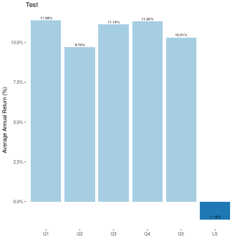

```python

from lquantPy import LQuant

```


```python
wq = LQuant.LQuant()
```

    2019-03-06 10:11:23,525 - lquantPy.LQuant - INFO - Initial LQuant. This may take some time...
    2019-03-06 10:11:23,527 - lquantPy.LQuant - INFO - Initialized LQuant environment
    2019-03-06 10:11:23,528 - lquantPy.LQuant - INFO - Initializing LQuant, This will take some time....


    Library Path -Djava.library.path=/usr/local/lib/R/site-library/rJava/jri


### Ravenpack Factors
|Factor |Description| 
|-------|-----|
|RPNA_FF_ESS_1D|Event Sentiment Score (ESS) Aggregated over 1 day|
|RPNA_FF_NO_1D|Number of Relevant Stories Published|


### 1. Get Data

Fetch data from lquant for Ravenpack factors


```python
# Build request object
req = wq.new_request()
req = req.a('TICKER').a('COMPANYNAME').a('SEDOL').a('QES_GSECTOR')

# Raw factors
req = req.a('RPNA_FF_ESS_1D').a('RPNA_FF_NO_1D')

# Smoothed factors
req = req.a('RPNA_FF_ESS_1D_AV1M').a('RPNA_FF_NO_1D_AV1M')

req = req.runFor('SP500').at('1me')
req = req.start('2010-12-31').to('2018-12-31')

req = req.addInFlag().addForwardReturn()

req.forFactor('RPNA_FF_ESS_1D_AV1M').mask()
req.forFactor('RPNA_FF_NO_1D_AV1M').mask()

rpdata = wq.get_data(req)


```

    2019-03-06 10:38:32,738 - lquantPy.LQuant - INFO - Fetching Data


```python
rpdata
```


    data_9:List of 12 elements [[TICKER, COMPANYNAME, SEDOL, QES_GSECTOR, RPNA_FF_ESS_1D, RPNA_FF_NO_1D, RPNA_FF_ESS_1D_AV1M, RPNA_FF_NO_1D_AV1M, IN_SP500, PRCCD, CUM_DIV, FRTN1P]]


```python
df = rpdata.as_large_data_frame()
```


```python
df.head()
```


<div>
<style scoped>
    .dataframe tbody tr th:only-of-type {
        vertical-align: middle;
    }

    .dataframe tbody tr th {
        vertical-align: top;
    }

    .dataframe thead th {
        text-align: right;
    }
</style>
<table border="1" class="dataframe">
  <thead>
    <tr style="text-align: right;">
      <th></th>
      <th>ID</th>
      <th>DATE</th>
      <th>TICKER</th>
      <th>COMPANYNAME</th>
      <th>SEDOL</th>
      <th>QES_GSECTOR</th>
      <th>RPNA_FF_ESS_1D</th>
      <th>RPNA_FF_NO_1D</th>
      <th>RPNA_FF_ESS_1D_AV1M</th>
      <th>RPNA_FF_NO_1D_AV1M</th>
      <th>IN_SP500</th>
      <th>PRCCD</th>
      <th>CUM_DIV</th>
      <th>FRTN1P</th>
    </tr>
  </thead>
  <tbody>
    <tr>
      <th>0</th>
      <td>001045.04</td>
      <td>2010-12-31</td>
      <td>None</td>
      <td>American Airlines Group Inc</td>
      <td>None</td>
      <td>20.0</td>
      <td>NaN</td>
      <td>NaN</td>
      <td>NaN</td>
      <td>NaN</td>
      <td>NaN</td>
      <td>NaN</td>
      <td>0.000000</td>
      <td>NaN</td>
    </tr>
    <tr>
      <th>1</th>
      <td>001075.01</td>
      <td>2010-12-31</td>
      <td>PNW</td>
      <td>Pinnacle West Capital Corp</td>
      <td>2048804</td>
      <td>55.0</td>
      <td>1.179236</td>
      <td>0.589744</td>
      <td>1.151881</td>
      <td>0.727750</td>
      <td>1.0</td>
      <td>41.45</td>
      <td>41.915000</td>
      <td>-0.005187</td>
    </tr>
    <tr>
      <th>2</th>
      <td>001078.01</td>
      <td>2010-12-31</td>
      <td>ABT</td>
      <td>Abbott Laboratories</td>
      <td>2002305</td>
      <td>35.0</td>
      <td>0.986822</td>
      <td>1.725490</td>
      <td>0.969430</td>
      <td>0.836272</td>
      <td>1.0</td>
      <td>47.91</td>
      <td>20.280625</td>
      <td>-0.048215</td>
    </tr>
    <tr>
      <th>3</th>
      <td>001161.01</td>
      <td>2010-12-31</td>
      <td>AMD</td>
      <td>Advanced Micro Devices Inc</td>
      <td>2007849</td>
      <td>45.0</td>
      <td>0.600333</td>
      <td>0.501333</td>
      <td>0.940410</td>
      <td>0.683735</td>
      <td>1.0</td>
      <td>8.18</td>
      <td>0.005000</td>
      <td>-0.042787</td>
    </tr>
    <tr>
      <th>4</th>
      <td>001177.01</td>
      <td>2010-12-31</td>
      <td>AET</td>
      <td>Aetna Inc.</td>
      <td>2695921</td>
      <td>35.0</td>
      <td>0.600949</td>
      <td>0.532319</td>
      <td>0.956143</td>
      <td>0.664764</td>
      <td>1.0</td>
      <td>30.51</td>
      <td>18.022500</td>
      <td>0.079646</td>
    </tr>
  </tbody>
</table>
</div>


## 2. Backtest factors


```python
def quick_backtest (factor):
    backtest_request = wq.new_backtest_request()
    backtest_request = backtest_request.forFactor(factor)
    backtest_request.classMatrixFactor('QES_GSECTOR')
    backtest_request = backtest_request.withBins(5)
    res = wq.basic_backtest(rpdata, backtest_request)
    return res
    
```


```python
result = dict()
for factor in ['RPNA_FF_ESS_1D_AV1M','RPNA_FF_NO_1D_AV1M']:
    result[factor] = quick_backtest(factor)

```


```python
res1 = result['RPNA_FF_ESS_1D_AV1M']
```


```python
from IPython.display import Image
Image(res1.plot_CAGR('Test'))
```





